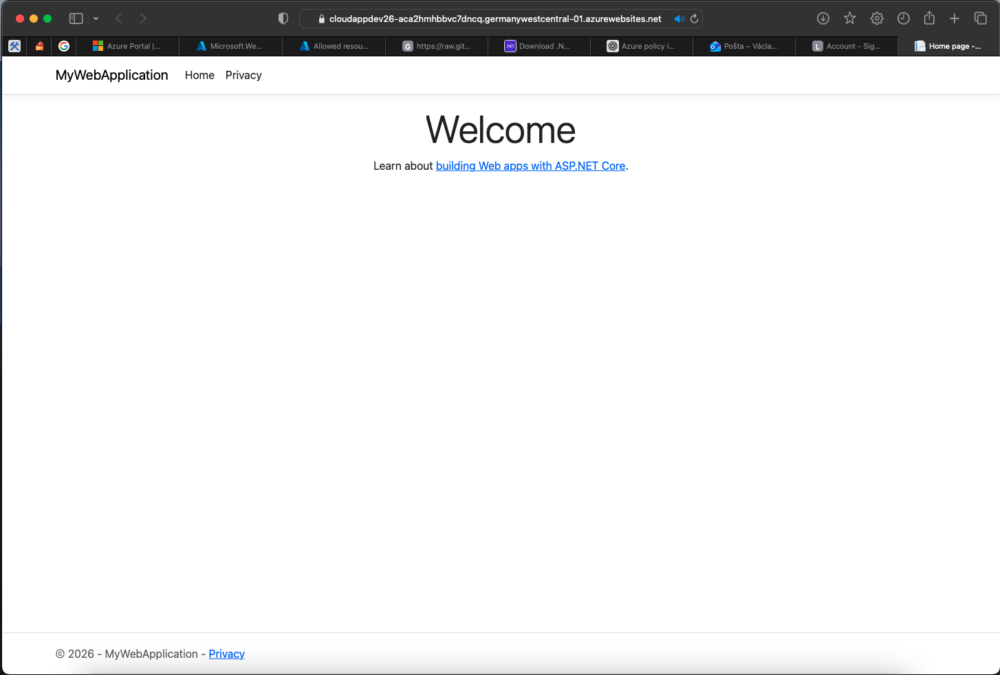
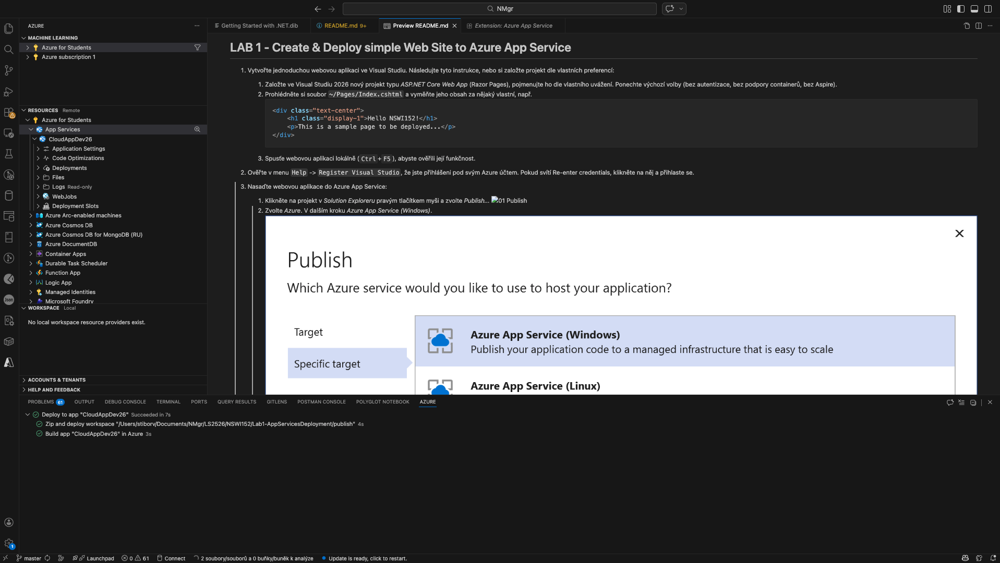
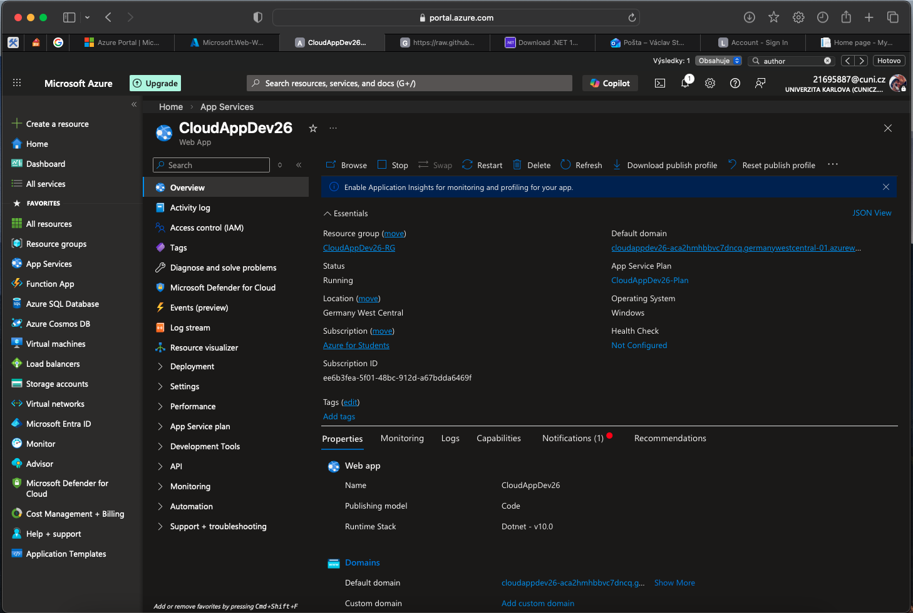

# Solution of Lab 1 - Create & Deploy simple Web Site to Azure App Service

Instrukce pro nasazení webové aplikace do Azure App Service pro VS Code na MacOS:

1. Nainstalujte VS Code rozšíření:
	- **Azure App Service**
	- **Azure Account**
2. Přihlaste se do Azure:
	- Command Palette (<kbd>⇧</kbd>+<kbd>⌘</kbd>+<kbd>P</kbd>) → `Azure: Sign In`
3. Otevřete Azure panel (ikona Azure v levém sidebaru) a v sekci **App Service** vytvořte web app:
	- `+` → *Create New Web App (Advanced)*
	- vyberte subscription, vytvořte resource group a hosting plan (pro shodu s labem můžete zvolit **Windows**; funguje i **Linux**)
4. Publikujte aplikaci lokálně (vygenerujte výstup pro deploy):
	- z kořene labu (složka, kde je podsložka `MyWebApplication/`):
		- `cd MyWebApplication`
		- `dotnet publish -c Release -o ../publish`
	- (alternativně bez `cd`: `dotnet publish MyWebApplication/MyWebApplication.csproj -c Release -o ./publish`)
5. Deploy do Azure App Service:
	- v Azure panelu (App Service) klikněte pravým na cílovou web app → *Deploy to Web App...*
	- vyberte složku `publish` vytvořenou předchozím krokem
