# Solution of Lab 10 – Azure Networking

## Screenshots

### Bootstrap a ověření (`azure_networking_scripts`):
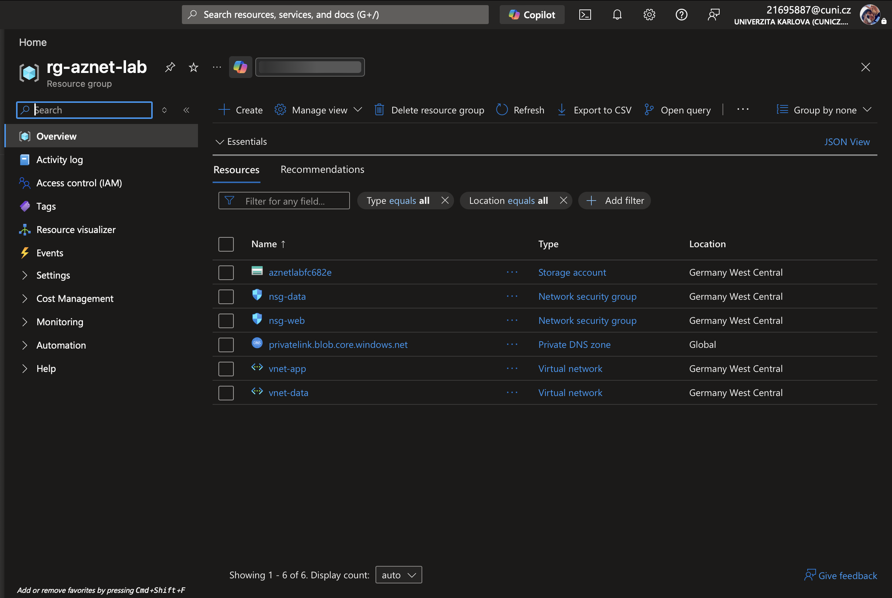

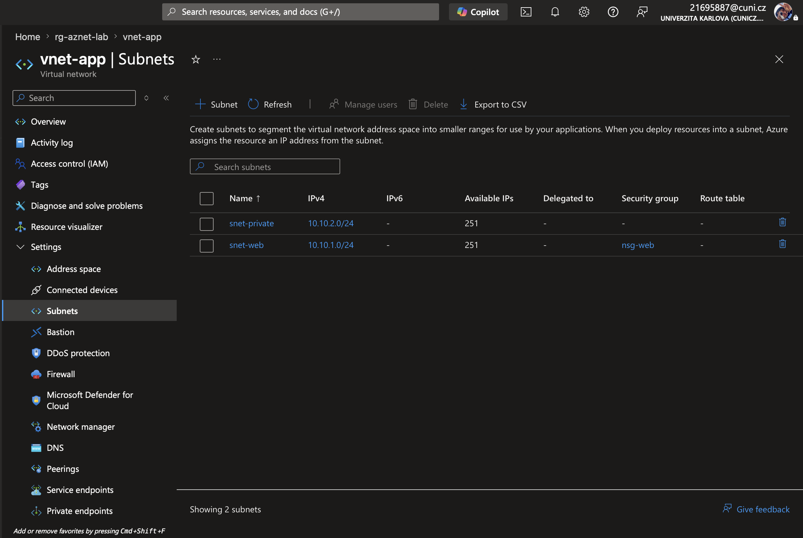

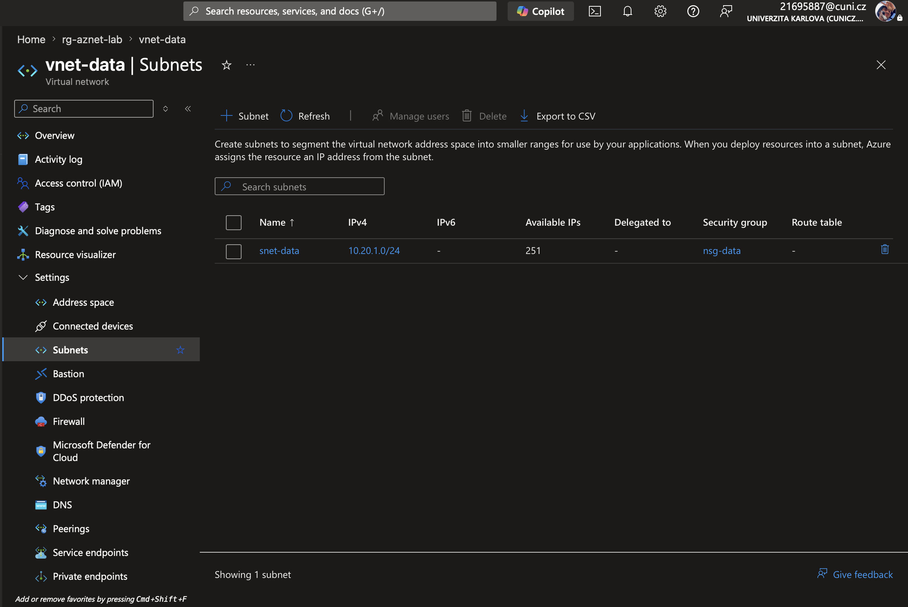

Bootstrap a finální ověření lokálně přes Azure CLI (`./00-bootstrap.sh`, `./01-verify.sh`). Region **`germanywestcentral`** — `westeurope` blokovaný na Azure for Students. Výstup verify: [`terminal_output.txt`](terminal_output.txt).

### Blob před Private Link (veřejný přístup ještě funguje):
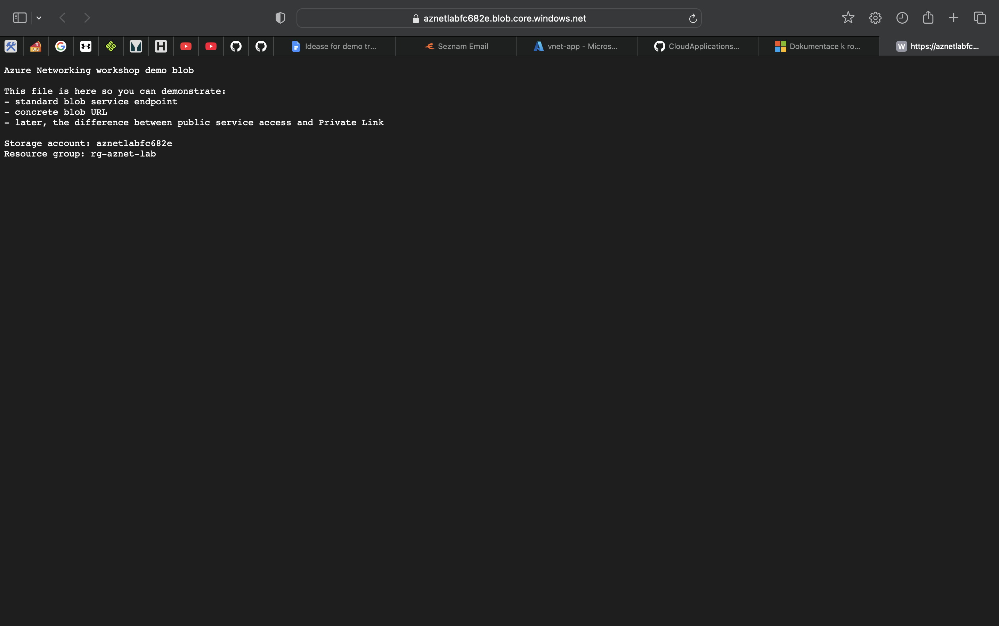

### VNet peering (`vnet-app` ↔ `vnet-data`):
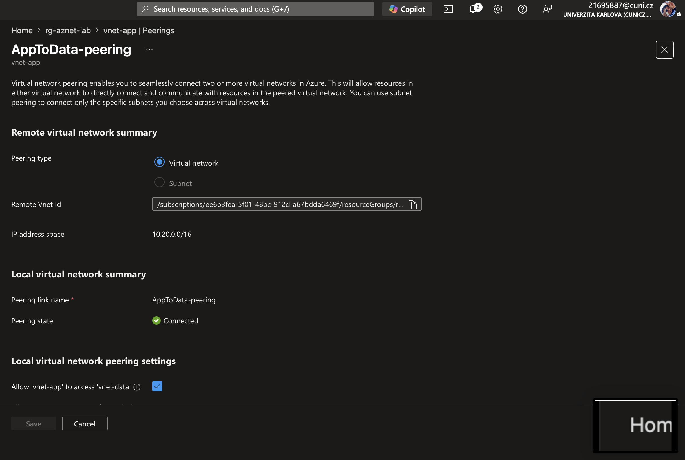

### NSG na `nsg-data` (Allow 443 + Deny zbytek):
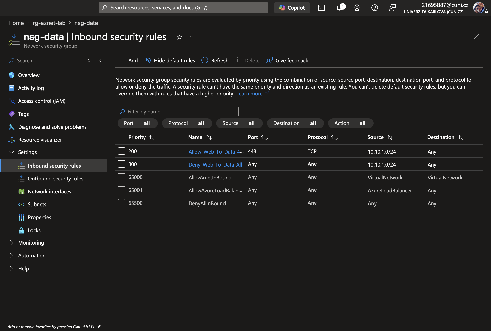

### Private Endpoint pro blob storage:
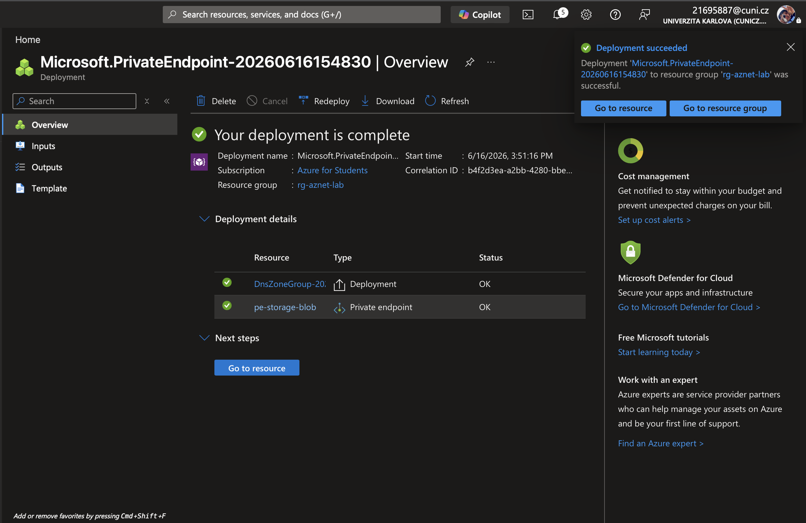

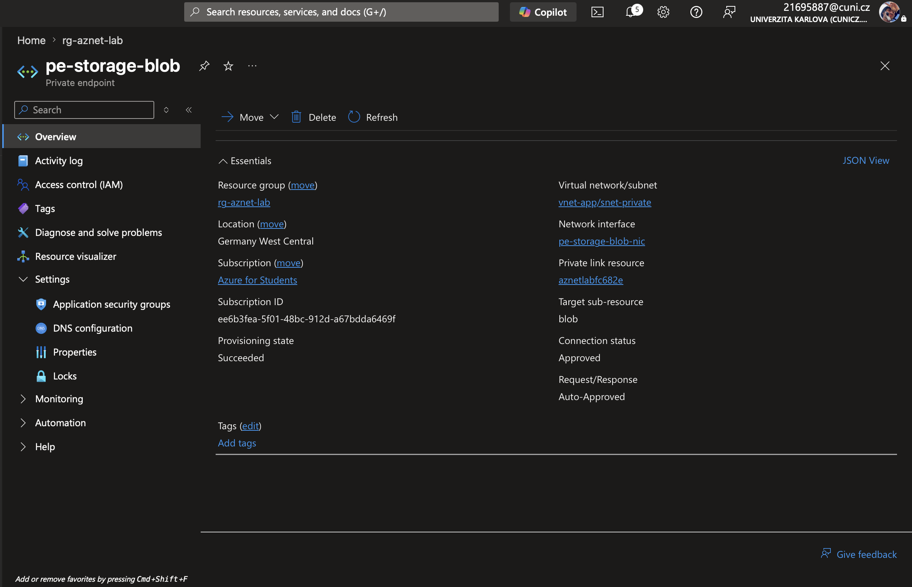

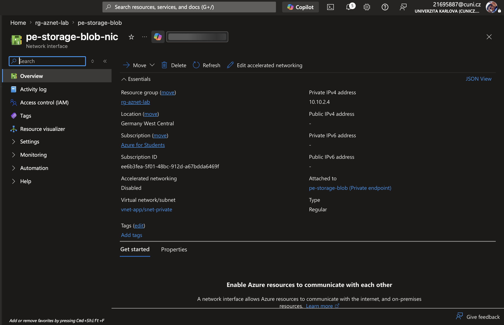

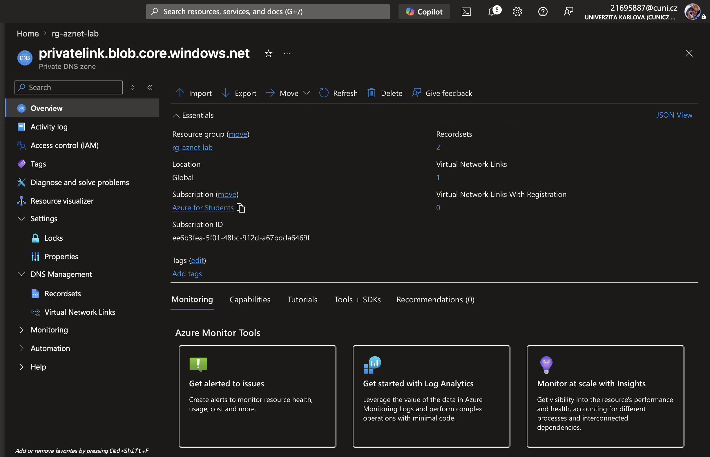

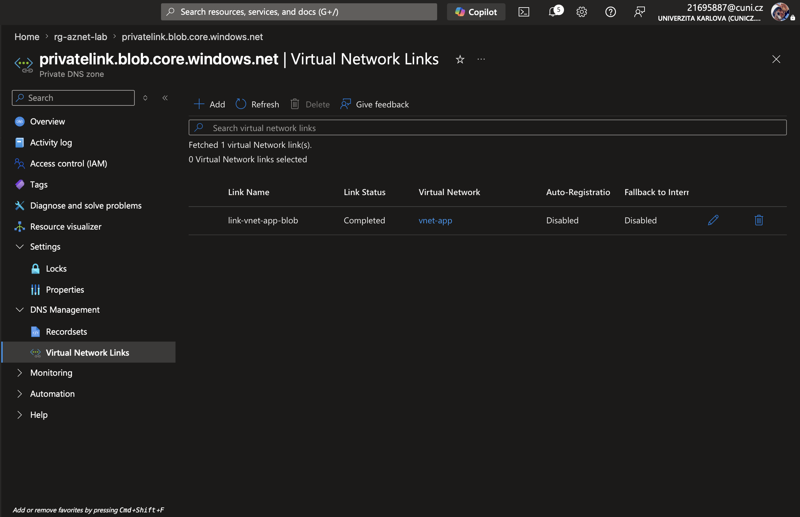

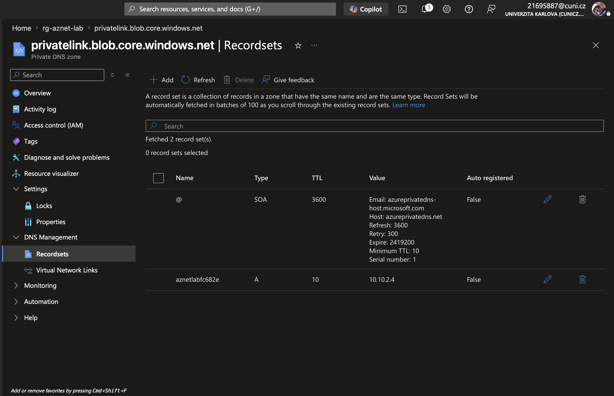

### Zákaz veřejného přístupu ke Storage:
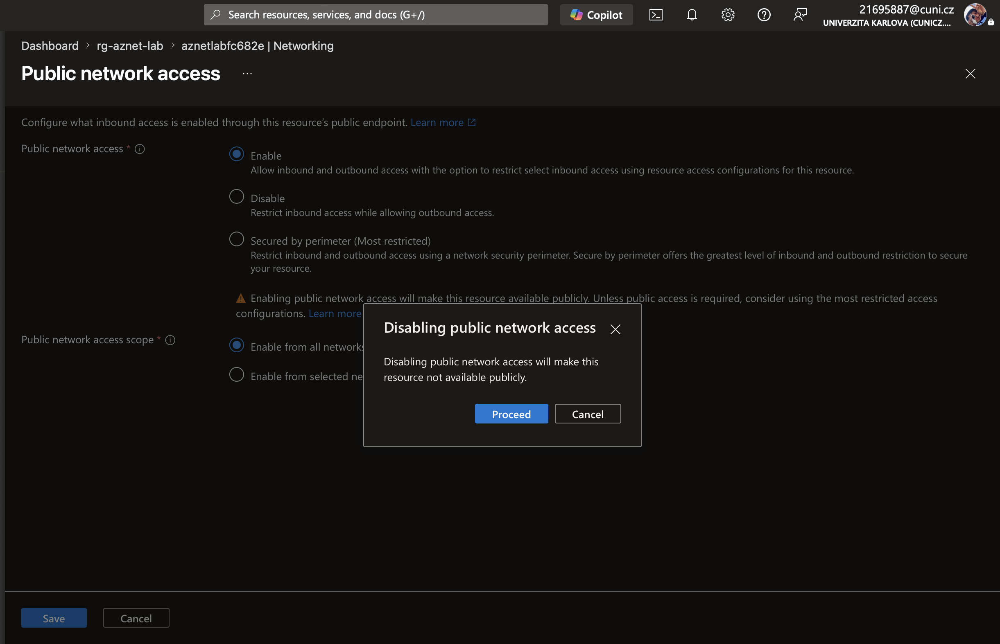

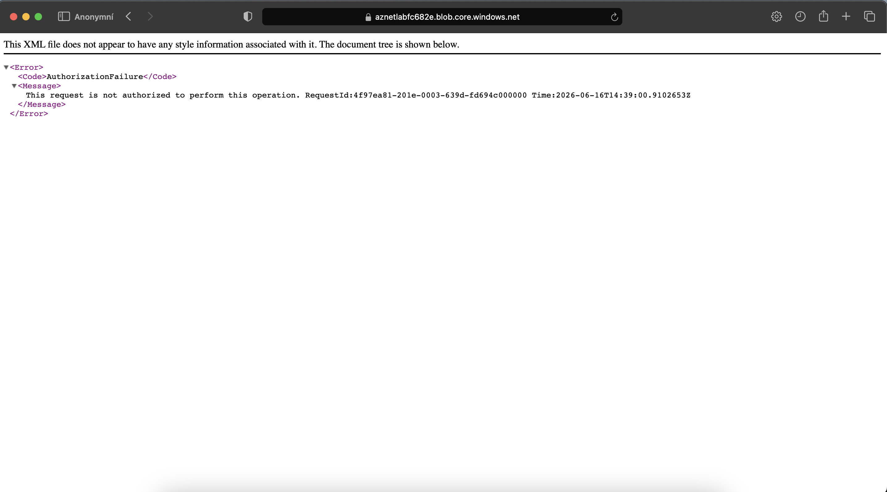

*(Prohlížeč může mít blob v cache; po Disable vrací Azure 403 — ověřeno i přes `curl`.)*

## Summary

- Bootstrap: RG **`rg-aznet-lab`**, VNety **`vnet-app`** / **`vnet-data`**, NSG, Storage **`aznetlabfc682e`**, demo blob, Private DNS zone — region **Germany West Central**.
- **VNet peering** `AppToData-peering` — stav **Connected**.
- **NSG** `nsg-data`: Allow TCP 443 ze `10.10.1.0/24`, Deny zbytek (prio 200 / 300).
- **Private Endpoint** `pe-storage-blob` v `snet-private`; DNS A záznam → **`10.10.2.4`**.
- **Public network access** na Storage **Disabled** — blob z internetu nejde (`AuthorizationFailure`).

Po kurzu: `99-cleanup.sh` nebo smazat RG `rg-aznet-lab`.
