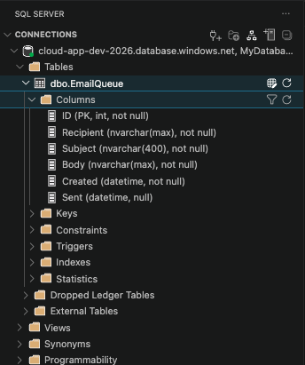
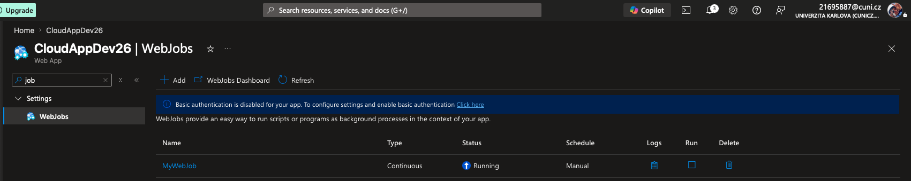
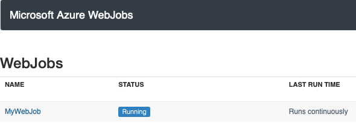
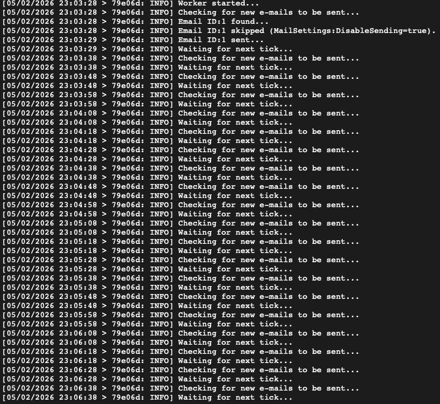
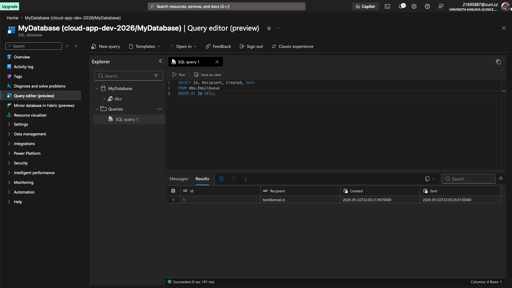

# Solution of Lab 2 - Azure SQL & Azure WebJob

## Screenshots

### DB Table `EmailQueue`:

### WebJob Overview:

### WebJob Dashboard:

### WebJob Logs:

### SQL Explorer - Recepient Created Sent:

## Summary
- Vytvoren projekt WebJob (.NET 6 Console) s periodickym ctenim tabulky `EmailQueue`.
- WebJob odesila e-maily pres SMTP a oznacuje zaznamy jako odeslane (`Sent`).
- V Azure vytvorena SQL Database + SQL Server a pridana pravidla firewallu.
- WebJob publikovan do Azure App Service (z Lab1) jako *Continuous* job.