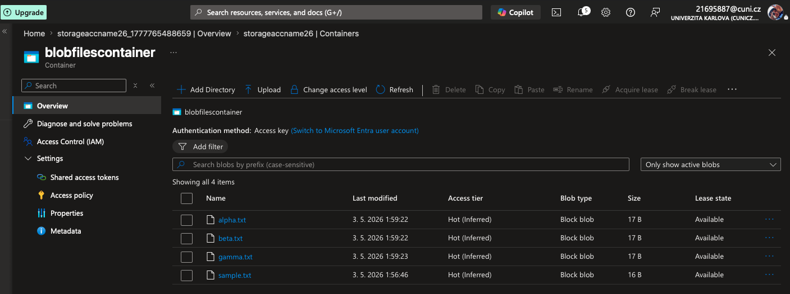
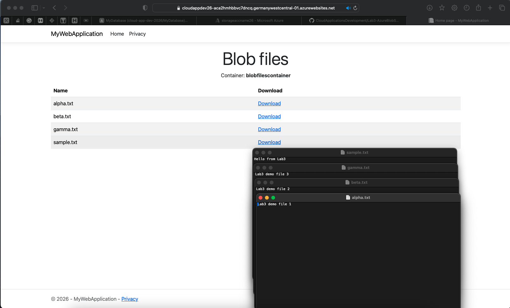

# Solution of Lab 3 - Azure Blob Storage

## Screenshots

### Blob Storage Container:

### Page With Donwloads:

### Recording of Page With Downloads:

## Summary
- Vytvoren Azure Storage account a neveřejný container pro blob soubory.
- Do Razor Pages aplikace doplnena podpora `Azure.Storage.Blobs`.
- Hlavni stranka zobrazuje seznam blobu z containeru a umi je stahovat pres aplikaci.
- Aplikace je nasazena do Azure App Service a ma nakonfigurovany connection string i container name.

