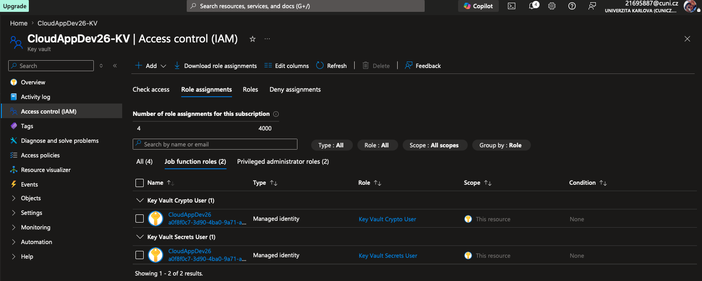
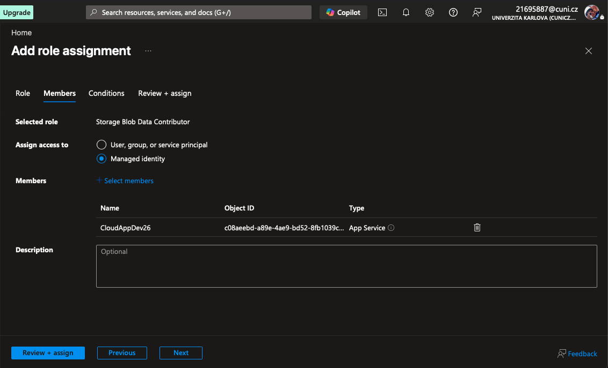
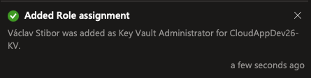
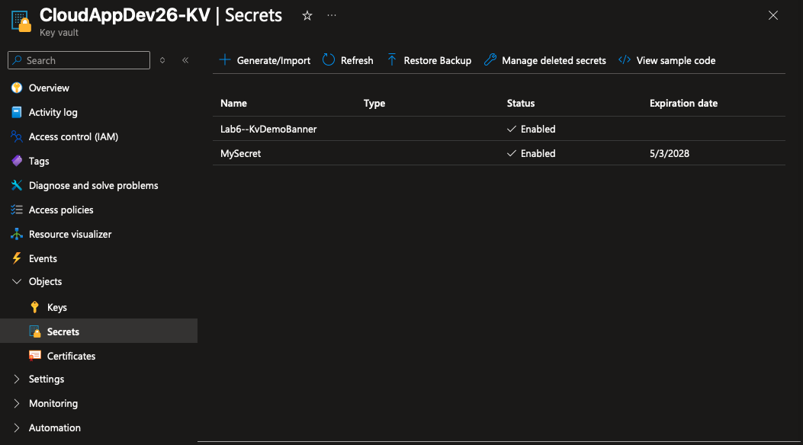
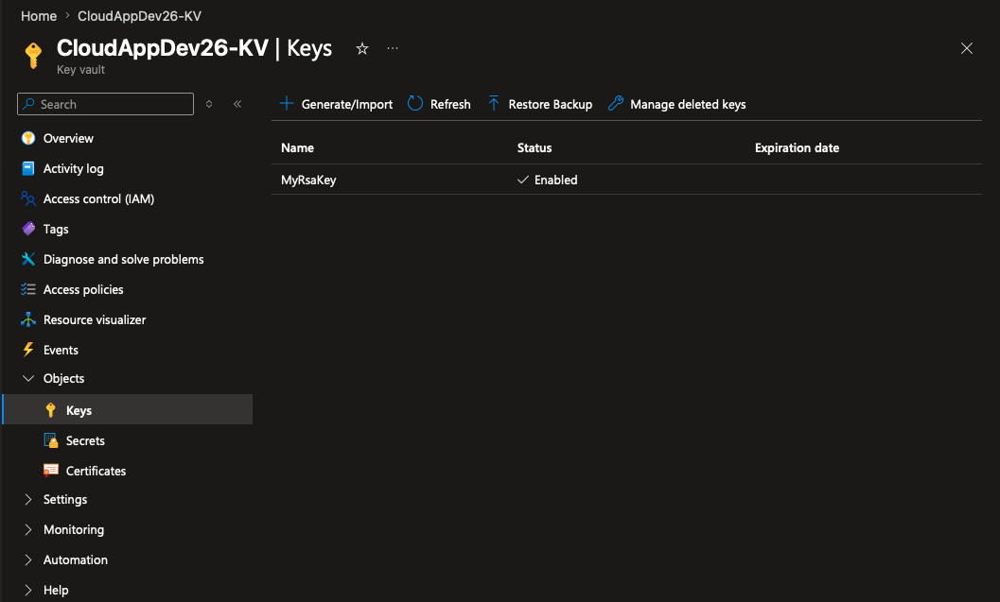
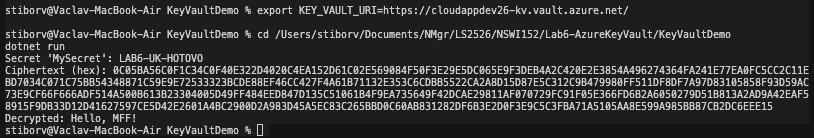
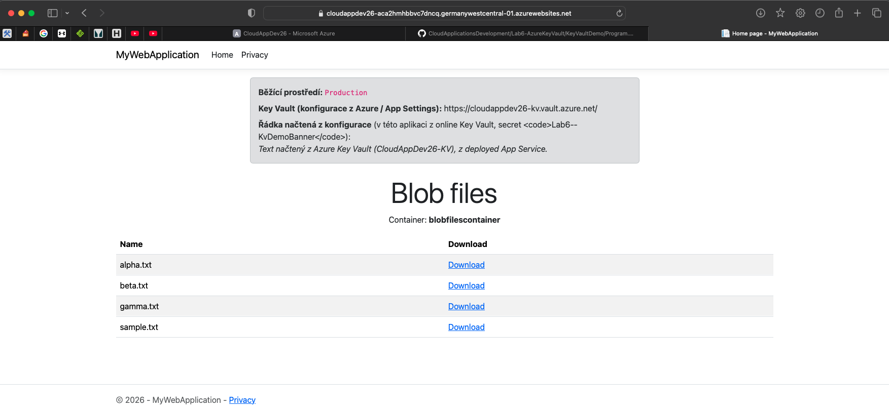

# Solution of Lab 6 - Azure Key Vault & Managed Identity

## Screenshots

### Access control (IAM) – permissions overview:

### IAM – add role assignment:

### IAM – additional assignment (Key Vault secrets management / Forbidden on `setSecret` resolved):

### Key Vault – Secrets:

### Key Vault – Keys:

### Console – KeyVaultDemo (`dotnet run`, secret read + RSA encrypt/decrypt):

### Deployed app – Production, Key Vault banner and blob listing:

## Summary

- **System-assigned Managed Identity** enabled on **App Service**; the principal was granted **Storage Blob Data Contributor** on the blob **container** (data-plane access without a storage connection string in code).
- **Azure Key Vault** uses **RBAC**. The App Service identity was granted **Key Vault Secrets User** and **Key Vault Crypto User**. To create secrets in the portal under my own account, **Key Vault Secrets Administrator** was added where needed (fixes **Forbidden** on `Microsoft.KeyVault/vaults/secrets/setSecret/action`).
- In the web app (`Lab6-AzureKeyVault/MyWebApplication`): **`BlobContainerClient`** with **`DefaultAzureCredential()`** and container URI from configuration; **`AddAzureKeyVault`** wired in **Production** with the vault URI and the same credential chain.
- The vault defines **Secrets** (**`MySecret`**, **`Lab6--KvDemoBanner`** mapped to **`Lab6:KvDemoBanner`** for the homepage banner) and an **RSA key** for the console cryptography demo.
- **`KeyVaultDemo`**: validated locally after **`az login`** and **`KEY_VAULT_URI`** – secret retrieval and RSA-OAEP encrypt/decrypt (`Hello MFF!`).
- **App Service → Environment variables** include **`BlobStorage__AccountName`**, **`BlobStorage__ContainerName`**, **`KeyVault__VaultUri`**, and **`ASPNETCORE_ENVIRONMENT=Production`**. The site was deployed with **ZIP deploy** and verified on the public HTTPS URL.
