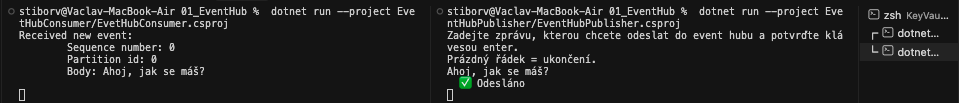
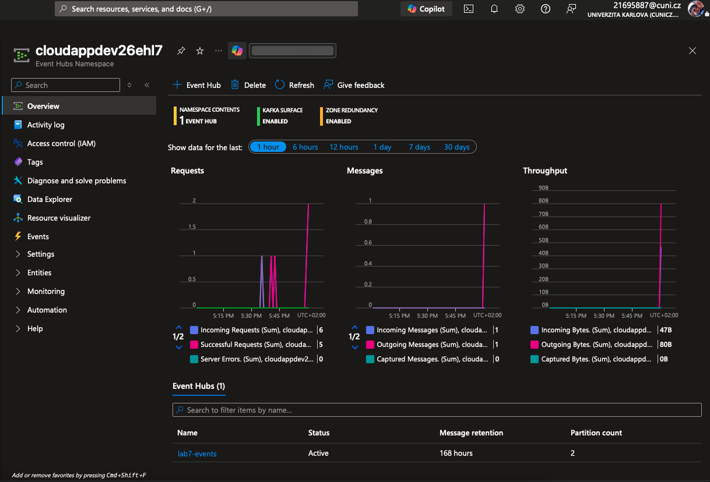
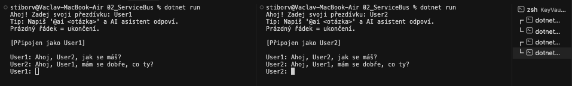
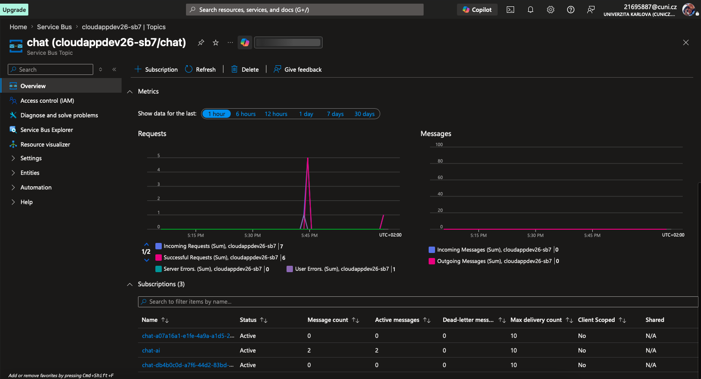
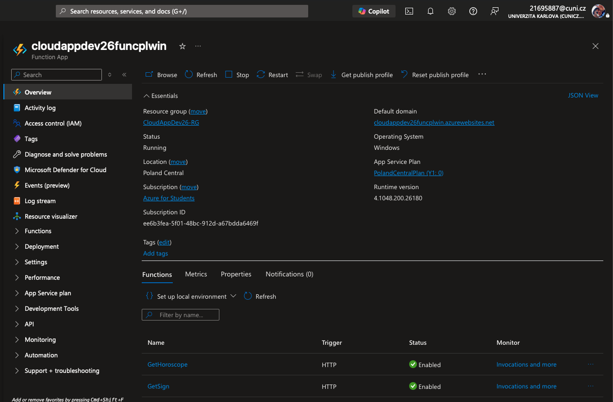
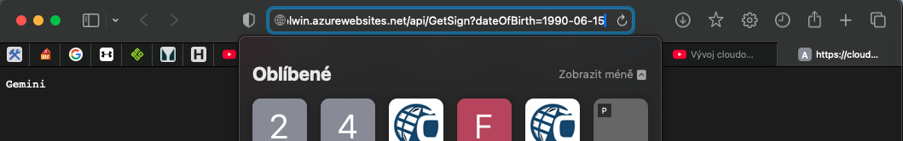
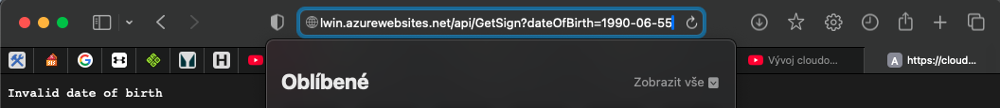
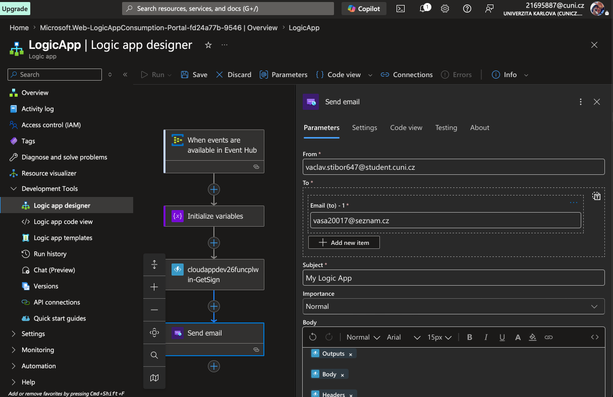
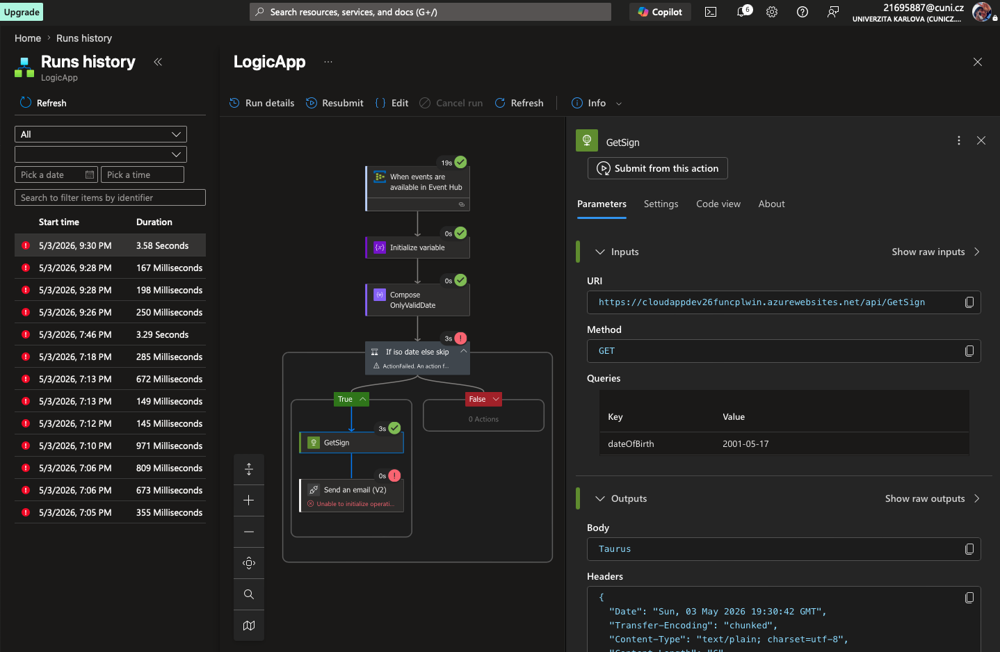

# Solution of Lab 7 – Serverless

## Screenshots

### Event Hub – publisher a consumer (`01_EventHub`):

### Event Hub – namespace a hub v portálu:

### Service Bus – chat ve dvou konzolích (`02_ServiceBus`):

### Service Bus – topic `chat` a subscriptions:

### Azure Functions – Function App v portálu (`03_AzureFunctions`):

### Azure Functions – GetSign v produkci (platné datum):

### Azure Functions – GetSign – neplatné datum:

### Logic App – designer (`04_LogicApps`):

### Logic App – historie běhu (`04_LogicApps`):

Po odeslání `2001-05-17` do Event Hubu proběhne trigger, proměnná i **GetSign** (odpověď *Taurus*). Krok **Send an email (V2)** u mě končí chybou *Unable to initialize operation…* – viz screenshot.

S mailovým krokem jsem se dost pral. Pod školním účtem (`@student.cuni.cz`), pod kterým jsem přihlášený do Azure, mi nešlo přes Outlook konektor normálně dokončit OAuth – nemám u něj poštovní schránku jako u osobního `@outlook.com` účtu, takže z něj neumím posílat na jiné adresy (třeba `vasa20017@seznam.cz`). Gmail jsem zkoušel taky, ale Azure to v jednom workflow s Event Hubem a HTTP akcí stejně zablokuje. ACS jsem kvůli ověřené doméně neřešil. Tok je tedy hotový a **GetSign z Logic App běží**; doručený mail jsem reálně neověřil.

## Summary

- **Event Hubs** (`cloudappdev26ehl7`, hub `lab7-events`): publisher, consumer a portál.
- **Service Bus** (`cloudappdev26-sb7`): topic `chat`, chat ve dvou konzolích.
- **Azure Functions** (`cloudappdev26funcplwin`): nasazený **GetSign**, ověřeno v prohlížeči (platné i neplatné datum).
- **Logic App**: Event Hub → proměnná → **GetSign** → e-mail; běh v run history, vše v pořádku až na finální krok odeslání mailu -- problem s ověřením mailového účtu (řešil jsem to asi 3 hodiny..).
