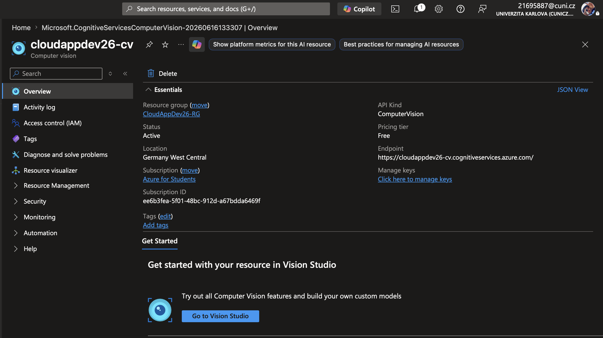
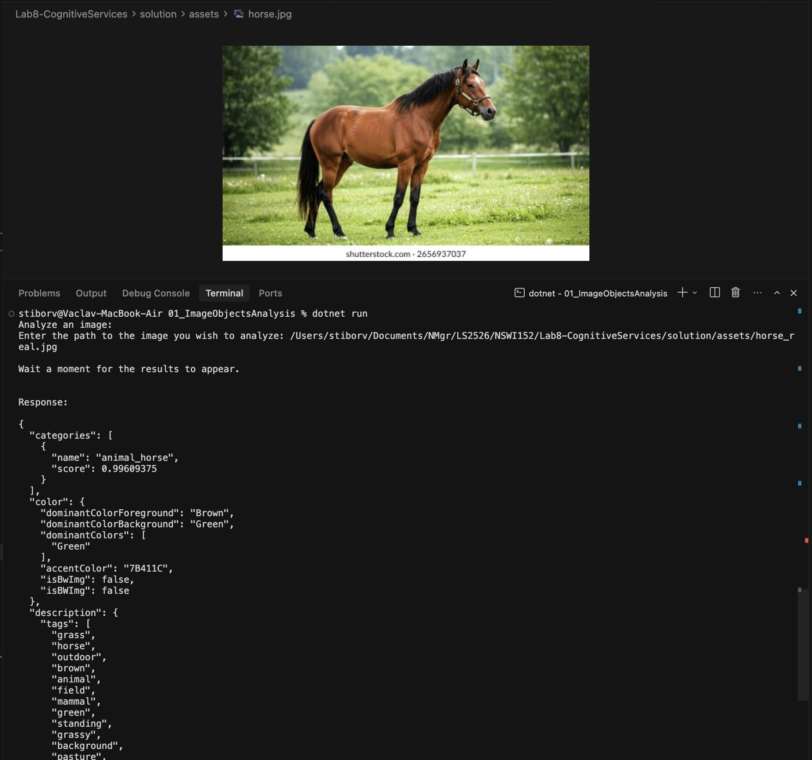
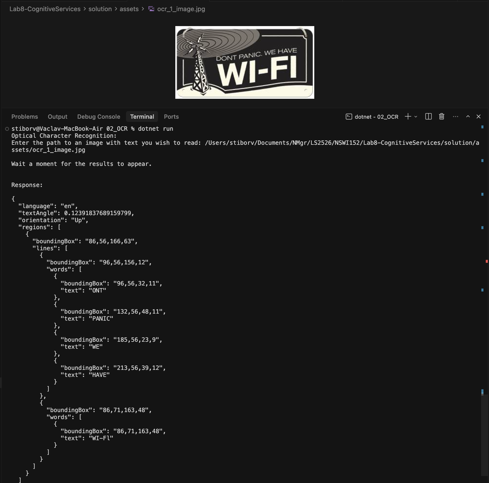
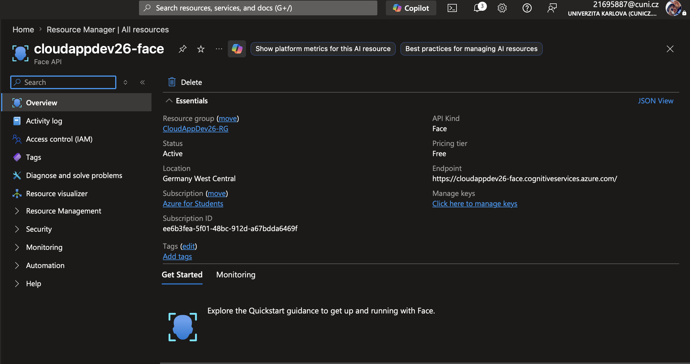
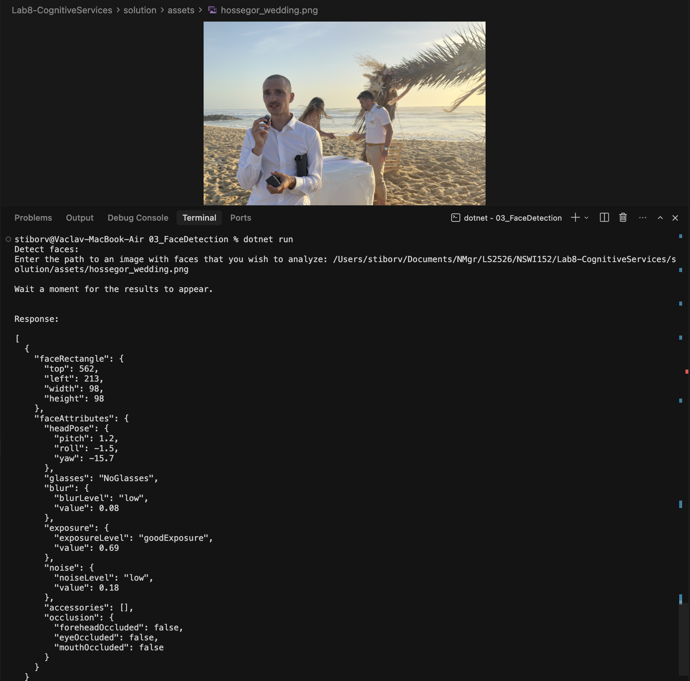
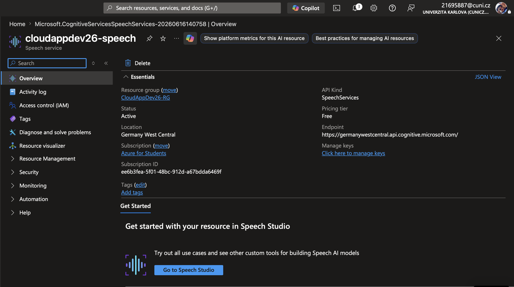
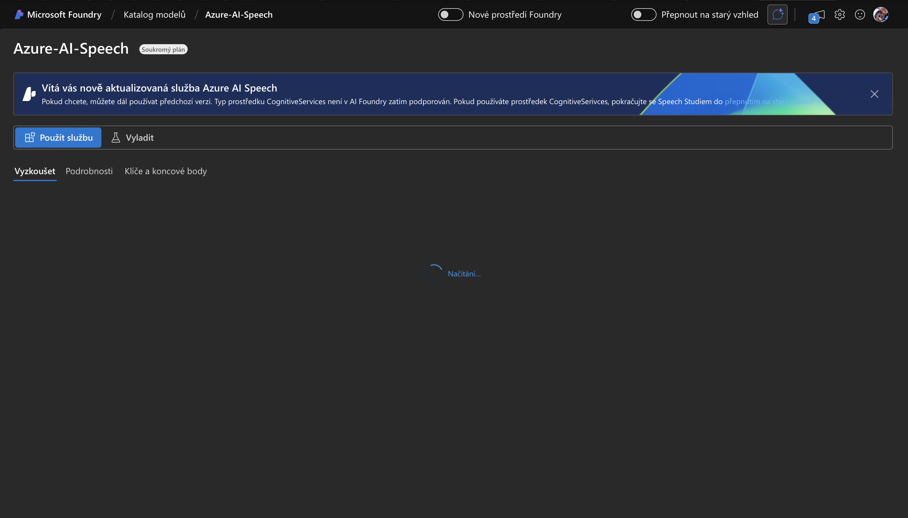
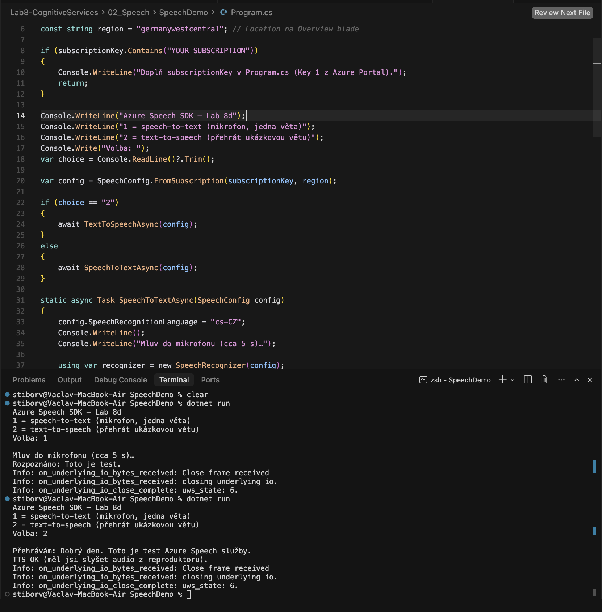

# Solution of Lab 8 – Cognitive Services

## Screenshots

### 8a – Computer Vision (analýza obrázku):

*(vstupní obrázky v [`assets/`](assets/) – např. `horse.jpg`)*

### 8b – OCR:

### 8c – Face Detection:

### 8d – Speech:

[speech.microsoft.com](https://speech.microsoft.com/) a nové AI Foundry u resource typu **CognitiveServices** (`cloudappdev26-speech`) u mě zůstalo na *Načítání…* — typ resource Foundry zatím nepodporuje. Proto **8d** přes **Speech SDK** konzoli [`02_Speech/SpeechDemo`](../02_Speech/SpeechDemo/) místo webového studia.

## Summary

- **Computer Vision** (`cloudappdev26-cv`, Germany West Central): analýza obrázku a OCR přes konzolové projekty; endpoint z portálu (`*.cognitiveservices.azure.com`).
- **Face** (`cloudappdev26-face`): detekce obličejů, vlastní resource.
- **Speech** (`cloudappdev26-speech`): resource v Azure OK, **webové Speech Studio nešlo** → ověřeno přes **Speech SDK** (`dotnet run` v `SpeechDemo`).
